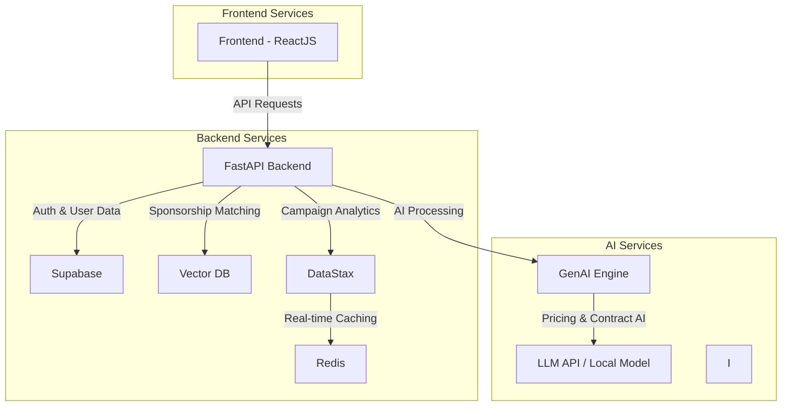
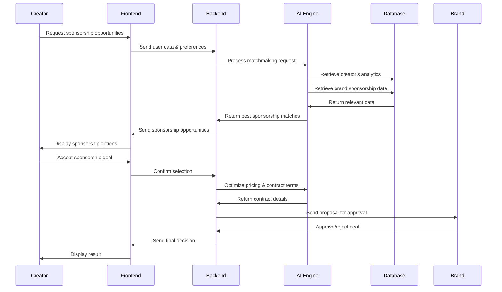

# Inpact: AI-Powered Creator Collaboration & Sponsorship Matchmaking Platform

## Project Overview
**Inpact** : AI-powered platform designed to connect content creators, brands, and agencies through data-driven insights. It enables influencers to discover relevant sponsorship deals, collaborate with like-minded creators, and optimize brand partnerships.

### Key Features:
- **AI-Driven Sponsorship Matchmaking**: Matches creators with brands based on audience demographics and engagement.
- **AI-Powered Creator Collaboration Hub**: Connects creators for joint projects and cross-promotions.
- **AI-Based Pricing & Deal Optimization**: Provides fair sponsorship pricing using market insights.
- **AI-Powered Negotiation & Contract Assistant**: Structures deals and generates contracts via AI.
- **Performance Analytics & ROI Tracking**: Monitors sponsorship effectiveness and audience engagement.

---

## Tech Stack

### Frontend:
- **ReactJS**: UI development framework.
- **Tailwind CSS**: Styling for responsive design.
- **ShadCN/UI**: Modern UI components.
- **Framer Motion**: Animations.

### Backend:
- **FastAPI**: High-performance backend framework.
- **Python**: Core backend language.

### Database & Storage:
- **Supabase**: PostgreSQL-based backend as a service.
- **Redis**: Caching and real-time analytics.

### AI & Analytics:
- **Generative AI (LangChain, OpenAI API, or Local Models)**: AI-driven matchmaking & negotiation.
- **Vector Databases (Weaviate, Pinecone, or ChromaDB)**: Similarity searches for sponsorship recommendations.

### DevOps & Deployment:
- **Docker**: Containerization.

---

## Architecture Diagram

---

## Workflow Diagram

---
